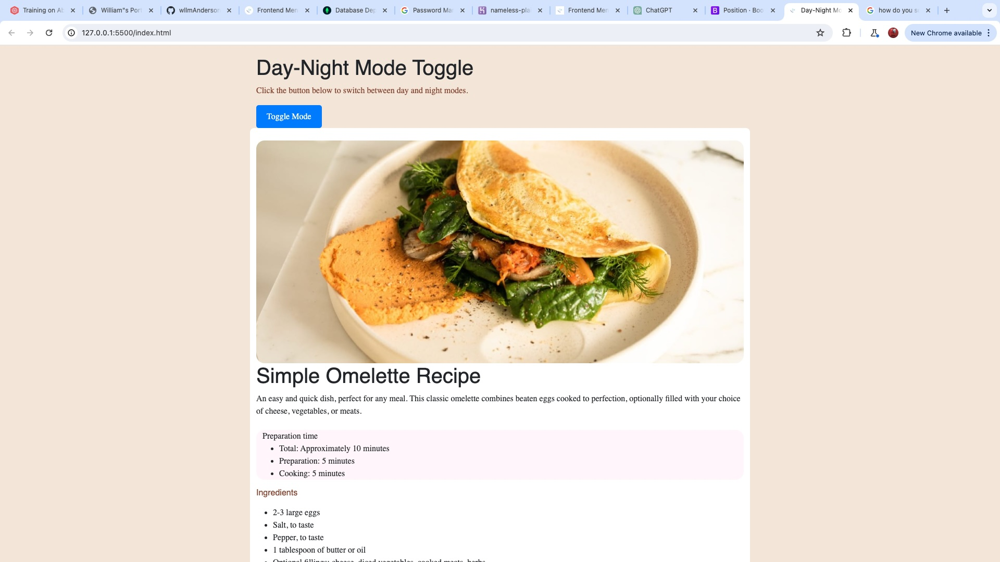

# Frontend Mentor - Recipe page solution

This is a solution to the [Recipe page challenge on Frontend Mentor](https://www.frontendmentor.io/challenges/recipe-page-KiTsR8QQKm). Frontend Mentor challenges help you improve your coding skills by building realistic projects. 

## Overview

### Screenshot

### Links

- [Solution URL](https://github.com/wllmAnderson/recipe-page-main
- [Live Site URL](https://wllmanderson.github.io/recipe-page-main/)

## My Process

### Built with

- Semantic HTML5 markup
- CSS custom properties
- Flexbox
- CSS Grid
- Mobile-first workflow
- JavaScript for interactive features

### What I Learned

During this project, I learned how to toggle between day and night modes using JavaScript. I also practiced responsive design techniques to ensure the page looks good on various devices.

### Continued Development

In future projects, I plan to focus on improving my JavaScript skills and exploring more advanced CSS techniques.

### Useful Resources

- [MDN Web Docs](https://developer.mozilla.org/en-US/) - A comprehensive resource for HTML, CSS, and JavaScript documentation.
- [Frontend Mentor Community](https://www.frontendmentor.io/community) - A supportive community where you can get feedback and connect with other developers.

## Author

- Frontend Mentor - [@wllmAnderson](https://www.frontendmentor.io/profile/wllmAnderson

